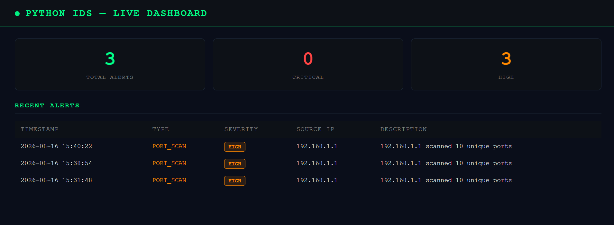

# Python IDS — Network Intrusion Detection System

A real-time Network Intrusion Detection System built with Python, Scapy, and Flask. Monitors live network traffic, detects threats, and displays alerts on a live web dashboard.

## Features

- Live packet capture — monitors all network traffic in real time
- Port scan detection — detects Nmap-style SYN scans and port sweeps
- Brute force detection — flags repeated login attempts on SSH, RDP, FTP, Telnet
- SQLite logging — all packets and alerts stored persistently
- Live web dashboard — real-time alert viewer with severity badges, auto-refreshes every 5 seconds

## Dashboard Preview

## Project Structure

    python-IDS/
    ├── src/
    │   ├── database.py      # SQLite setup and queries
    │   ├── sniffer.py       # Packet capture with Scapy
    │   ├── detector.py      # Detection rules (port scan, brute force)
    │   └── alerter.py       # Alert retrieval and logging
    ├── templates/
    │   └── index.html       # Flask dashboard UI
    ├── logs/                # SQLite database and alert logs
    ├── main.py              # IDS engine entry point
    ├── app.py               # Flask dashboard entry point
    └── requirements.txt

## Installation

    git clone https://github.com/Stavros-Saridis/python-IDS.git
    cd python-IDS
    python -m venv venv
    venv\Scripts\activate
    pip install -r requirements.txt

Install Npcap from https://npcap.com — enable "WinPcap API-compatible mode" during install.

## Usage

Terminal 1 — Start IDS engine (requires administrator):

    python main.py

Terminal 2 — Start dashboard:

    python app.py

Open browser at http://127.0.0.1:5000

## Testing Detection

With the IDS running, trigger a port scan:

    nmap -sS <your-local-ip>

The dashboard will display a PORT_SCAN alert with HIGH severity within seconds.

## Tech Stack

| Tool | Purpose |
|------|---------|
| Python 3.12 | Core language |
| Scapy 2.7 | Packet capture and analysis |
| Flask 3.1 | Web dashboard |
| SQLite | Alert and packet storage |
| Nmap | Testing detection rules |

## Author

Stavros Saridis — BSc Computer Science (First Class Honours), University of Derby
MSc Cybersecurity student | Aspiring SOC Analyst
GitHub: https://github.com/Stavros-Saridis
LinkedIn: https://linkedin.com/in/stavros-saridis